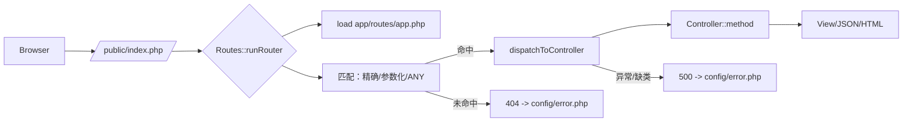

# Photonix MVC 框架总述（v0.9.2）

> Photonix 是由 Nexogic 以“大简而美”为原则打造的轻量级 MVC PHP 框架，兼容 PHP 8.x，面向小到中型 Web 应用与 API 服务，强调易用与可扩展。

## 1. 框架概述

- 核心功能：
  - 路由调度（GET/POST/PUT/DELETE/PATCH/OPTIONS/ANY），支持参数化路由 `/user/{id}`。
  - 控制器调用（`Namespace\Class/method`），可选显式文件路径引入。
  - 错误页统一输出（404/500 等，来自 `config/error.php`）。
  - 环境变量加载（`PhotonixCore\Env`），统一配置管理。
  - 视图引擎（`PhotonixView-v2`/`PhotonixView-lite`，预留接口）。
  - Composer PSR-4 自动加载与 Apache/Nginx 重写支持。

- 技术栈：PHP 8.x、Composer（PSR-4）、Apache/Nginx、JSON/ENV 配置、轻量工具类。

- 适用场景：中小型网站、管理后台、原型验证、轻量 API 服务、教学与学习。

## 2. 架构设计

### 2.1 模块划分

- `PhotonixCore/`：框架内核
  - `Routes.php`：路由注册与调度、参数化匹配、错误页输出。
  - `Env.php`：环境变量读取。
  - `Data.php`：常用数据校验工具。
  - `Photonix.php`：框架信息与路径工具。
  - `view/`：视图引擎接口（待完善）。

- `app/`：业务应用
  - `routes/app.php`：集中注册应用路由。
  - `home/controller/`：控制器目录（示例：`App\Home\Controller\Index`）。
  - `baseController.php`：控制器基类与通用响应方法。

- `public/`：入口与静态资源
  - `index.php`：入口文件（`Routes::runRouter()`）。
  - `.htaccess` / `nginx.htaccess` / `router.php`：重写与路由至入口。

- `config/`：配置文件（错误页、视图配置、数据库等）。
- `vendor/`：Composer 依赖与自动加载。
- `runtime/`：缓存与日志。
- `views/`、`models/`、`plugin/`：视图、模型、插件拓展空间。

### 2.2 整体架构图



## 3. 核心特性

- 多方法路由：`get/post/put/delete/patch/options/any`。
- 参数化路由：占位符 `{name}`，支持多段与命名分组；方法接收 `$params` 数组。
- 自动加载应用路由：调度前会自动一次性加载 `app/routes/app.php`。
- 错误页统一：404/500 输出来自 `config/error.php`，可自定义。
- 控制器灵活：支持命名空间类与可选显式文件路径加载（相对 `/app`）。
- 目录约定优于配置：一目了然的目录结构，易于上手。

## 4. 快速开始

### 4.1 安装

```bash
# 1) 安装依赖
composer install

# 2) 推荐 PSR-4（composer.json）
{
  "autoload": {
    "psr-4": {
      "App\\": "app/",
      "PhotonixCore\\": "PhotonixCore/"
    }
  }
}

# 3) 生成自动加载
composer dump-autoload
```

### 4.2 定义控制器

```php
<?php
namespace App\Home\Controller;

use App\baseController;
use PhotonixCore\Photonix;

class Index extends baseController
{
    public function index(): void
    {
        echo Photonix::version();
    }
}
```

### 4.3 注册路由（`app/routes/app.php`）

```php
<?php
use PhotonixCore\Routes;

// 根路径 -> 控制器
Routes::get("/", "App\\Home\\Controller\\Index/index", "/home/controller/index.php");

// 动态路由示例
Routes::get("/user/{id}", "App\\User\\Controller\\Profile/show", "/user/controller/Profile.php");
```

### 4.4 运行

- Apache：将站点根指向 `public/`，使用内置 `.htaccess`。
- Nginx：参考 `public/nginx.htaccess` 或根目录 `nginx.htaccess`。
- 访问 `http://127.0.0.1/` 即可触发路由调度。

## 5. 版本说明

- 当前版本：`0.9.2`（见 `version` 与 `photonix.env`）。
- 主要变更：
  - 路由内核新增参数化路由支持（`/user/{id}`）。
  - 调度前自动加载 `app/routes/app.php`（无需入口手动 require）。
  - 错误页统一输出，兼容 `config/error.php`。
  - 兼容性提升：替换 `str_starts_with` 为 `substr` 判断路径前缀。

---

如需更详细的路由说明与 API，请参考 `docs/router/` 目录下文档。

